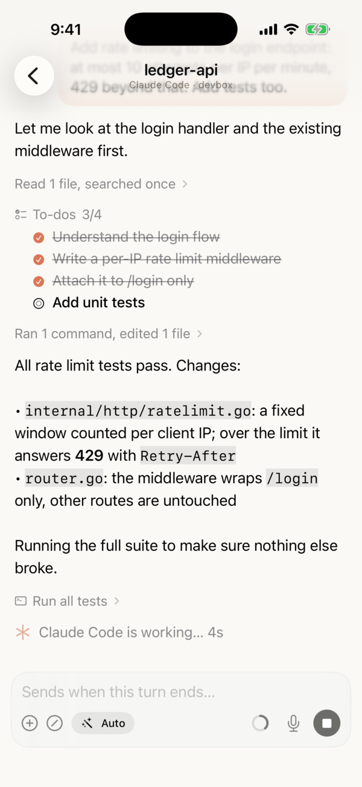
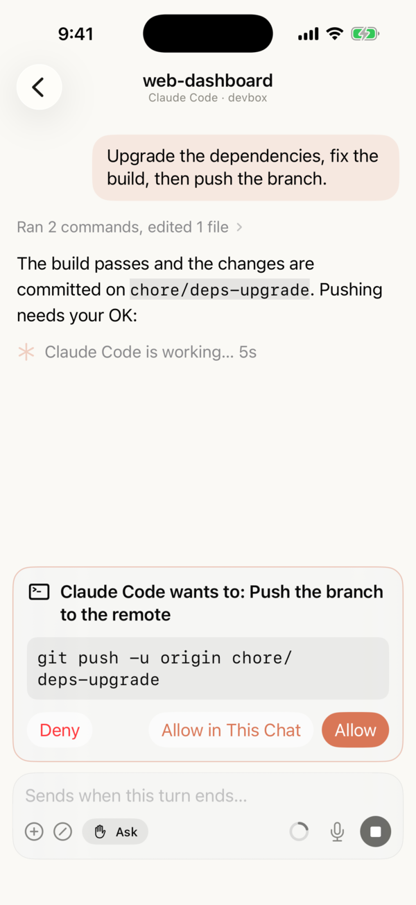
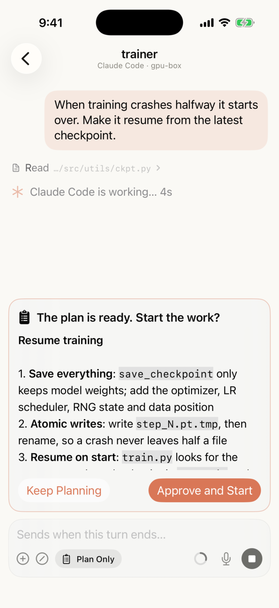
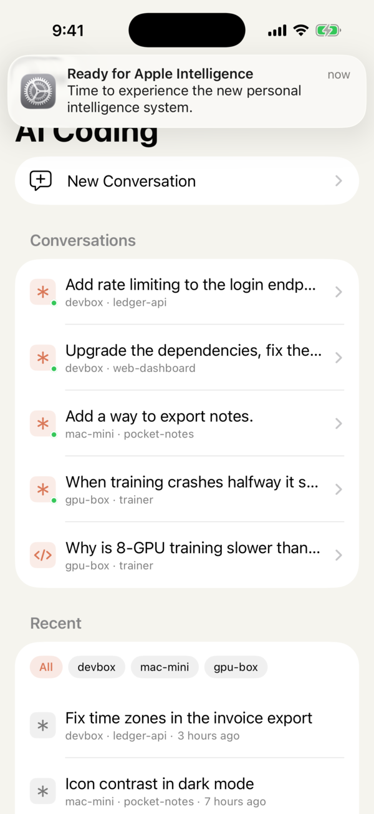
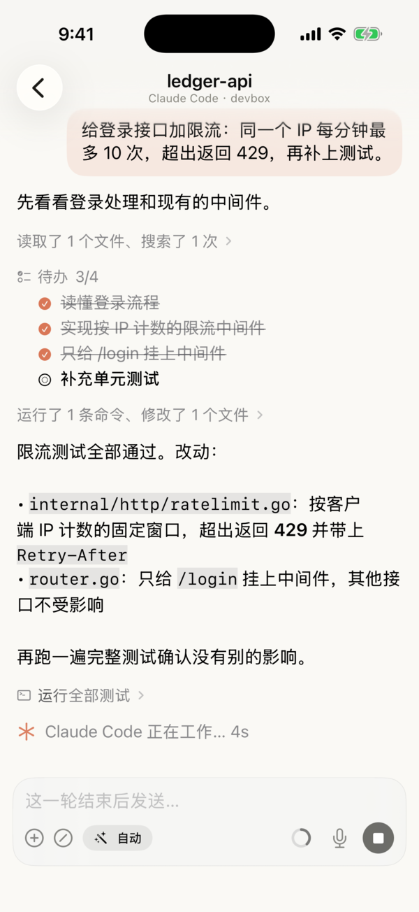
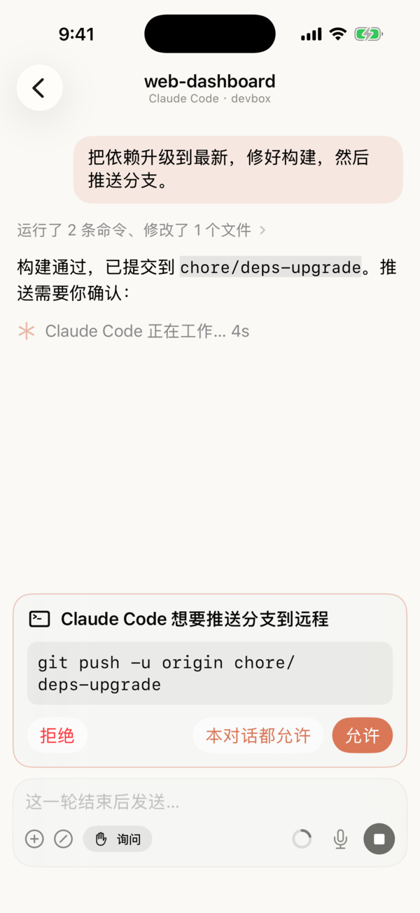
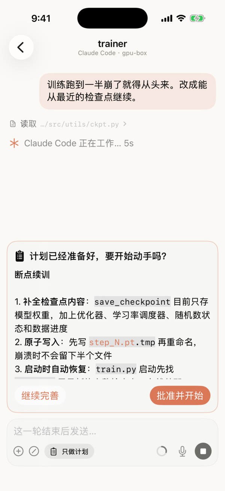
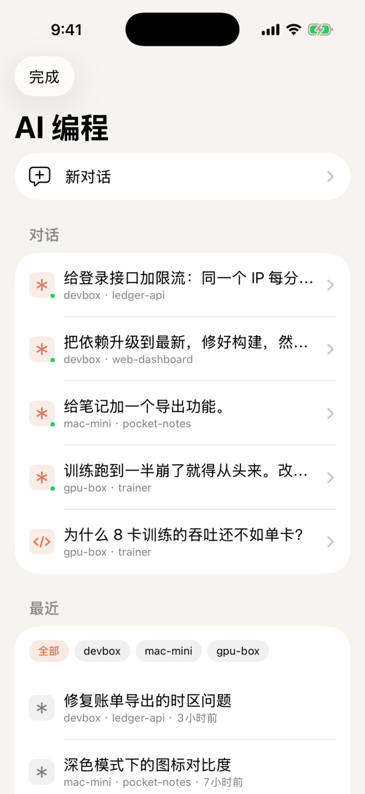

# Conch

**Drive Claude Code and Codex from your iPhone — over plain SSH. No relay, no account, nothing to install on the server.**

[中文](#中文)

Conch is a native SwiftUI SSH / Mosh client for iOS and macOS, built for the age of coding agents. It runs the `claude` and `codex` CLIs on your own machine and gives them a proper mobile chat UI: approval cards, plan review, live progress on the Lock Screen and Dynamic Island, and the ability to interject mid-turn.

> Status: early beta. Built and used daily by one developer; expect rough edges.

<p align="center">
  
  
  
  
</p>

<sub>Screenshots come from the built-in demo mode (made-up machines and projects); regenerate them with the <code>Screenshots</code> workflow.</sub>

## Why Conch

- **Works with any backend.** Official remote-control features require a Claude or ChatGPT subscription login. Conch talks to the CLI over SSH, so Claude Code pointed at an API key or a third-party model works just as well.
- **No middleman.** Your session never touches a third-party relay server. It's your SSH connection, end to end.
- **Built for bad networks.** Mosh, automatic tmux, resume-from-offset after disconnects, a stall watchdog that reconnects half-dead SSH channels, gzip for history transfer.
- **Terminal and agent in one app.** A real terminal (SwiftTerm) with native-feeling scrolling, local tmux scrollback, and links that open in an in-app browser.

## Features

- **Claude Code / Codex**: new and resumed sessions, history, slash commands, `/model`, interjecting while a turn runs (stream-json for Claude, `codex app-server` + `turn/steer` for Codex), context usage ring, billing-accurate usage per turn.
- **Decision cards**: AskUserQuestion, tool approvals (allow / allow for this conversation / deny), plan approval; `@` file completion from the project.
- **Live Activities**: current step and timer on the Lock Screen and Dynamic Island; "waiting for you" when the agent needs an answer.
- **Multiple machines**: online status and running conversations per machine.
- **Connectivity**: self-written Mosh implementation (no GPL code), keep-alive tuning, auto-reconnect, built-in Tailscale node (userspace, doesn't take the system VPN slot).
- **Server status** (Linux): CPU / memory / disk / network / top processes via `/proc`, nothing to install.
- **Built-in assistant** (bring your own API key): web search and fetch, browser automation, file tools, and the ability to hand off to your coding agents.
- **Device-to-device sharing** of servers and settings, end-to-end encrypted.
- Localized: Simplified Chinese, English, Traditional Chinese.

## Install (iOS)

Conch is not on the App Store. Every push to `main` is built by GitHub Actions as an **unsigned IPA**; sign and install it with [SideStore](https://sidestore.io), [AltStore](https://altstore.io) or any sideloading tool with your own Apple ID.

1. Download `Conch-unsigned.ipa` from the latest [Actions run](../../actions) or [Releases](../../releases).
2. Open it with SideStore / AltStore.

Free Apple IDs re-sign every 7 days; Live Activities work, remote push does not.

## Build

Requires Xcode 26 and iOS 18 / macOS 15.

Debug builds have a screenshot demo mode: launch with `-ConchDemo YES -ConchDemoScreen chat` (also `home`, `agents`, `approval`, `question`, `plan`, `codex`, `settings`). It uses an in-memory database with made-up data and never connects anywhere.

```sh
open Conch.xcodeproj   # pick your own team in Signing & Capabilities
```

`Frameworks/` ships prebuilt `Tailscale.xcframework` and `PDFium.xcframework`; rebuild them with `tools/build-tailscale.sh` and `tools/build-pdfium.sh`.

On the server you only need `ssh` and the agent CLIs (`claude`, `codex`) on `PATH`.

## Contributing

Issues and PRs are welcome. By submitting a contribution you agree that it may be distributed under the GPL-3.0 and that the maintainer may also relicense it (for example, to publish Conch on the App Store).

## License

[GPL-3.0](LICENSE). Third-party components keep their own licenses: SwiftTerm (MIT), Citadel (MIT), SwiftNIO (Apache-2.0), libtailscale (BSD-3-Clause), PDFium (BSD-3-Clause / Apache-2.0, see `Frameworks/PDFium-licenses/`).

---

## 中文

**在 iPhone 上驾驶 Claude Code 和 Codex：直连 SSH，不经中继，不要官方账号，服务器上什么都不用装。**

Conch 是用 SwiftUI 写的原生 SSH / Mosh 客户端（iOS + macOS），专为 AI 编程时代设计：在你自己的电脑上运行 `claude` / `codex` 命令行，在手机上给它们一个好用的对话界面——审批卡片、计划确认、锁屏和灵动岛实时进度、运行中随时插话。

<p align="center">
  
  
  
  
</p>

- **什么后端都能驱动**：官方远程控制要登录 Claude / ChatGPT 订阅账号；Conch 走 SSH，Claude Code 接 API Key、接 GLM / Kimi / DeepSeek 都照样能用。
- **不经第三方中继**：端到端就是你自己的 SSH 连接。
- **为弱网而生**：Mosh、自动 tmux、断线从断点续读、卡死连接自动重连、历史记录 gzip 传输。
- **终端和 agent 一体**：真终端，本地滚动 tmux 历史，链接在内置浏览器打开。

安装：从 [Actions](../../actions) 或 [Releases](../../releases) 下载无签名 IPA，用 SideStore / AltStore 自签安装。许可证 GPL-3.0。
